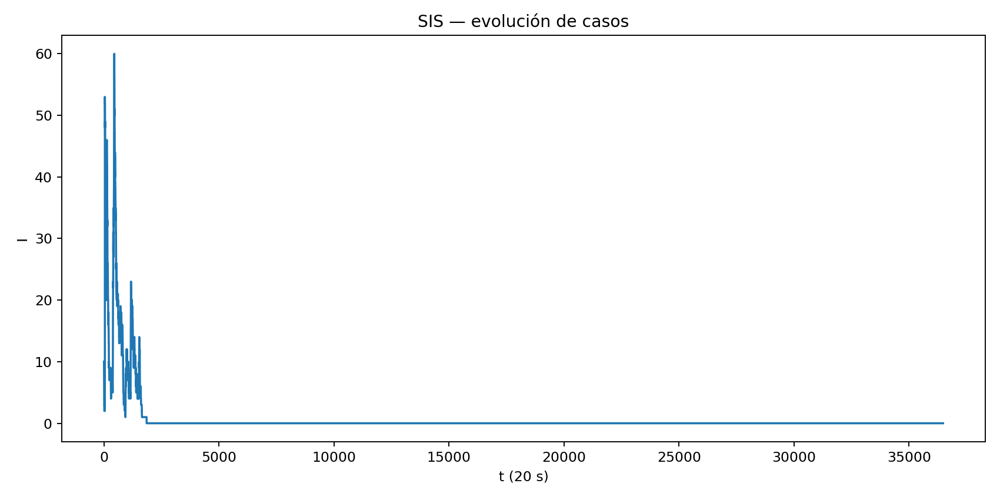
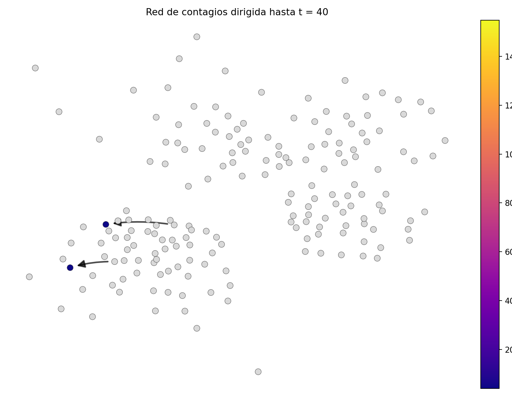
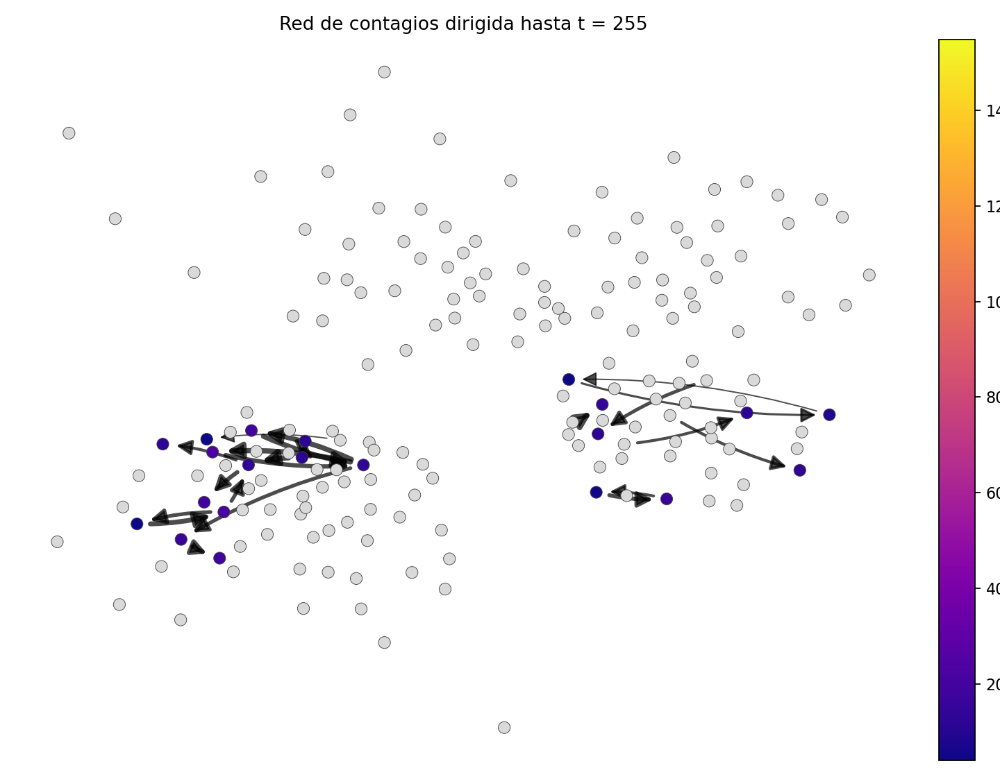
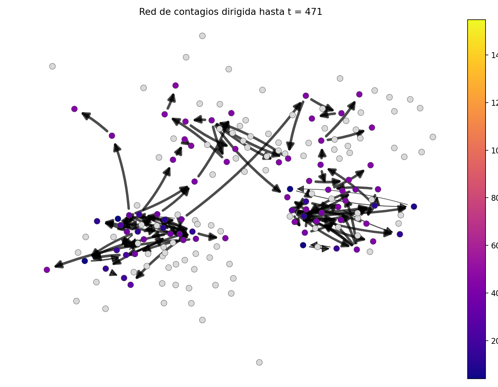
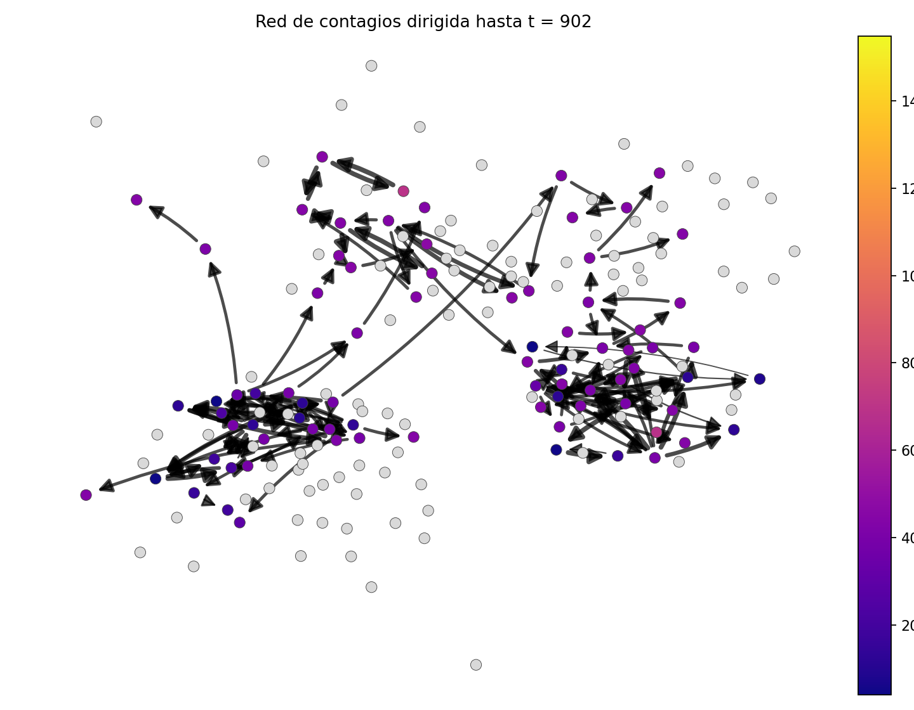
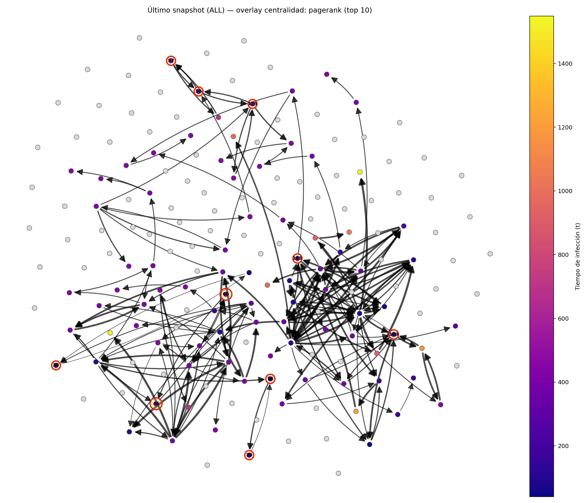

<p align="center">
  
</p>

<h1 align="center">Modeling Epidemic Spreading in Dynamic Networks using Graph Theory</h1>

<p align="center">
  <em>Stochastic SIS Epidemic Dynamics, Time-Respecting Paths (TBFS), Spectral Thresholds, and Centrality-Based Super-Spreader Identification on SocioPatterns High-School Contact Networks.</em>
</p>

<p align="center">
  <a href="https://www.python.org/"></a>
  <a href="https://networkx.org/"></a>
  <a href="https://jupyter.org/"></a>
  <a href="LICENSE"></a>
  <a href="https://urosario.edu.co/"></a>
</p>

<p align="center">
  <strong><a href="README.md">English</a></strong> | <strong><a href="README.es.md">Versión en Español</a></strong>
</p>

---

## 🔬 Research Overview & Abstract

In real-world epidemiology, human physical interactions are fundamentally **time-varying**, non-Markovian, and highly bursty. Traditional epidemic models that aggregate temporal contact data into static, time-invariant graphs introduce severe structural distortions—such as creating false topological connectivity and violating temporal causality, thereby artificially overestimating epidemic spreading rates and reachability.

This research project models the dynamic propagation of infectious diseases (such as COVID-19) by deploying a **stochastic Susceptible-Infected-Susceptible (SIS) process over dynamic temporal networks**, leveraging real-world face-to-face contact telemetry from the **SocioPatterns High-School dataset** (Netzschleuder / SocioPatterns 2012). 

### Key Contributions:
1. **Time-Varying Network Discretization:** Parsing continuous-time proximity sensors into standardized time slices ($\Delta t = 20\text{ s}$), capturing temporal duration and interaction weights $w_t(u,v)$.
2. **Causal Infection Digraph ($G_{\text{inf}}$):** Reconstructing the exact, directed propagation tree of transmission events, enabling real-time tracking of transmission chains and infection timestamps $t_{\text{infect}}$.
3. **Time-Respecting Breadth-First Search (TBFS):** Implementing a temporal BFS algorithm that strictly enforces the arrow of time to compute causal arrival times ($\text{arrival}(v)$) and reachability from Patient Zero.
4. **Spectral Epidemic Threshold Analysis:** Contrasting static spectral theory ($\tau_c \approx 1/\lambda_{\max}(A_{\text{agg}})$) with effective empirical transmission rates ($\tau = \beta / \delta$).
5. **Super-Spreader Identification via Directed Centrality:** Applying **PageRank**, **Betweenness Centrality**, and **Out-Degree** on $G_{\text{inf}}$, demonstrating that structural degree in the static aggregated graph $G_{\text{agg}}$ is insufficient to identify true epidemic drivers.
6. **Temporal Coarse-Graining Evaluation:** Assessing the distortion of temporal aggregation bins ($\Delta t \in [1, 1000]$ windows) on network reachability.

---

## 📐 Mathematical & Theoretical Formulation

### 1. Dynamic Network Representation
A dynamic contact network is represented as an ordered sequence of discrete-time graph snapshots:
$$\mathcal{G} = \{G_t = (V, E_t, w_t)\}_{t=1}^T$$
where $V$ is the set of individuals (nodes), $E_t \subseteq V \times V$ represents undirected active contacts occurring within temporal window $[(t-1)\Delta t, t\Delta t]$, and $w_t(u,v)$ denotes contact duration.

### 2. Time-Discrete Stochastic SIS Epidemic Model
Each individual $v \in V$ occupies a discrete state $\sigma_v(t) \in \{S, I\}$ at time $t$:
- **Susceptible $\to$ Infected ($S \to I$):** If node $v$ is susceptible at time $t$ ($\sigma_v(t) = S$), its probability of becoming infected at $t+1$ depends on its infected neighbors $N_t(v) \cap I_t$ and exposure duration:
  $$P(v \in I_{t+1} \mid v \in S_t) = 1 - \prod_{u \in N_t(v) \cap I_t} (1 - \beta)^{\max\left(1, \left\lfloor \frac{w_t(u,v)}{20} \right\rceil\right)}$$
  where $\beta \in (0,1)$ is the per-block transmission probability.
- **Infected $\to$ Susceptible ($I \to S$):** Infected individuals recover without permanent immunity with probability $\delta \in (0,1)$ at each time step:
  $$P(v \in S_{t+1} \mid v \in I_t) = \delta$$

```
   +-------------------+       Infection Rate: P(infection | w_t, beta)       +------------------+
   |  Susceptible (S)  | --------------------------------------------------> |   Infected (I)   |
   +-------------------+                                                     +------------------+
             ^                                                                         |
             |                               Recovery Rate: delta                      |
             +-------------------------------------------------------------------------+
```

### 3. Causal Infection Graph ($G_{\text{inf}}$)
Whenever a susceptible node $v$ is successfully infected by neighbor $u$ at time $t$, a directed causal edge is created:
$$e = (u \to v, t_{\text{infect}}) \in E_{\text{inf}}$$
This constructs a directed acyclic transmission subnetwork $G_{\text{inf}} = (V, E_{\text{inf}})$, preserving causality.

### 4. Time-Respecting Breadth-First Search (TBFS)
To determine if node $v$ is reachable from initial seed $v_0$ (Patient Zero), path transitions must satisfy chronological ordering $t_1 \le t_2 \le \dots \le t_k$:
$$\text{arrival}(v) = \min \left\{ t \in [1, T] \mid \exists \text{ a time-respecting path from } v_0 \text{ to } v \text{ by time } t \right\}$$
Unlike static geodesic distances $d_{\text{static}}(v_0, v) = \min |p_{\text{static}}|$, TBFS enforces physical causality and prevents invalid backward-in-time propagation.

### 5. Spectral Epidemic Threshold
In a static aggregated contact matrix $A_{\text{agg}}$, the critical epidemic threshold is governed by the leading eigenvalue $\lambda_{\max}(A_{\text{agg}})$:
$$\tau_c = \frac{1}{\lambda_{\max}(A_{\text{agg}})}$$
Comparing this with the effective spreading rate $\tau = \frac{\beta}{\delta}$ highlights the structural divergence between static linear stability approximations and non-stationary dynamic networks.

---

## 📊 Results & Visualizations

<p align="center">
  
  <br/>
  <em>Figure 1: Temporal evolution of active infected cases I(t) across discrete windows showing epidemic wave resurgence and saturation.</em>
</p>

### Dynamic Transmission Snapshots
Progression of the infection tree over time ($t = 40, 255, 471, 902$), where node color represents the arrival time of infection ($\text{plasma}$ colormap: earlier $\to$ yellow/orange, later $\to$ purple, uninfected $\to$ gray):

<p align="center">
  
  
  <br/>
  
  
  <br/>
  <em>Figure 2: Directed contagion expansion across temporal snapshots. Node color corresponds to initial infection timestamp.</em>
</p>

### Super-Spreader Centrality Overlay ($G_{\text{inf}}$)
<p align="center">
  
  <br/>
  <em>Figure 3: Top-10 super-spreaders identified via PageRank centrality on the directed infection graph G_inf with highlighted halos and weighted transmission edges.</em>
</p>

---

## 📁 Repository Structure

```text
MODELADO-DE-LA-PROPAGACION-DE-EPIDEMIAS-EN-REDES-DINAMICAS/
├── .gitignore                      # Git exclusion rules (.venv, pycache, archives)
├── LICENSE                         # MIT Open-Source License
├── README.md                       # Comprehensive English research documentation
├── README.es.md                    # Versión completa en Español
├── requirements.txt                # Reproducible Python dependencies
│
├── data/
│   ├── raw/                        # Raw SocioPatterns High-School contact telemetry
│   │   ├── edges.csv               # Raw contact interactions with timestamps
│   │   ├── gprops.csv              # Graph metadata
│   │   └── nodes.csv               # Node identity attributes
│   └── processed/                  # Normalized datasets (20s windows)
│       ├── contacts.csv            # (source, target, t_start, t_end, weight, directed)
│       └── nodes.csv               # (id, label, group)
│
├── docs/                           # Academic project documents
│   ├── Paper_Modelacion_Epidemias_Redes_Dinamicas.pdf  # Full 11-page scientific report
│   ├── Poster_Proyecto_Teoria_de_Grafos.pdf            # Academic presentation poster
│   └── Presentacion_Proyecto_Teoria_de_Grafos.pdf      # Presentation slides
│
├── figs/                           # High-resolution simulation figures and plots
│   ├── sis_I_curve.png             # Active infected cases I(t)
│   ├── snapshot_t*.png             # Sequential network snapshots
│   ├── infections_ALL_overlay_pagerank.png # Centrality overlay visualization
│   └── tbfs_coarse_reach_vs_bin.png # Temporal coarse-graining reachability plot
│
├── logo/
│   └── Macc.png                    # Institutional badge (UR - MACC)
│
├── media/
│   └── Grabacion_sis_animacion.mp4 # Full MP4 video recording of simulation animation
│
├── results/                        # Generated output dataframes and rankings
│   ├── infection_edges.csv         # Directed transmission events (source, target, t_infect)
│   ├── states_by_t.csv             # Epidemic state counts (t, S, I)
│   ├── rank_contact_degree.csv     # Degree ranking on static aggregated graph
│   ├── rank_infection_centrality.csv # Out-degree, PageRank, Betweenness on G_inf
│   └── rank_pagerank.csv           # PageRank ranking table
│
└── src/                            # Source code & Interactive Notebook
    ├── centrality_rankings.py      # Computes centrality metrics (PageRank, Betweenness, Out-Degree)
    ├── prepare_robusto_2012.py     # Data cleaning and temporal discretization (20s)
    ├── simulate_sis_and_infection_graph.py # Stochastic SIS dynamic simulation engine
    ├── sis_animacion.ipynb         # Interactive Jupyter Notebook (Full pipeline & TBFS)
    ├── viz_expansion.py            # Basic temporal infection expansion plots
    ├── viz_expansion_colored.py    # Multi-snapshot generation with plasma colormap
    ├── viz_expansion_directed.py   # Directed transmission edge visualizer
    └── viz_overlay_centrality.py   # PageRank overlay network renderer
```

---

## 🚀 Getting Started & Reproducibility

### 1. Clone the Repository
```bash
git clone https://github.com/JuanFeletes24/MODELADO-DE-LA-PROPAGACION-DE-EPIDEMIAS-EN-REDES-DINAMICAS.git
cd MODELADO-DE-LA-PROPAGACION-DE-EPIDEMIAS-EN-REDES-DINAMICAS
```

### 2. Environment Setup
Create a virtual environment and install the required scientific computing packages:
```bash
# Create virtual environment
python -m venv .venv

# Activate environment (Linux/macOS)
source .venv/bin/activate

# Activate environment (Windows PowerShell)
.venv\Scripts\Activate.ps1

# Install dependencies
pip install -r requirements.txt
```

### 3. Execution Pipeline

Execute the full scientific workflow in sequence:

```bash
# Step 1: Preprocess raw temporal contact telemetry into 20s discrete windows
python src/prepare_robusto_2012.py

# Step 2: Run stochastic SIS epidemic simulation on dynamic network
python src/simulate_sis_and_infection_graph.py

# Step 3: Compute centrality rankings on causal infection digraph
python src/centrality_rankings.py

# Step 4: Generate high-resolution figures, snapshots, and centrality overlays
python src/viz_expansion_colored.py
python src/viz_overlay_centrality.py
```

### 4. Interactive Jupyter Notebook
Launch Jupyter Notebook to explore the interactive simulation, step-by-step TBFS algorithm, and dynamic animations:
```bash
jupyter notebook src/sis_animacion.ipynb
```

---

## 💻 Jupyter Notebook Exploration (`sis_animacion.ipynb`)

The notebook `src/sis_animacion.ipynb` serves as the central interactive laboratory of this project:
1. **Header & Institutional Context:** Project metadata and academic credentials.
2. **Data Ingestion & SIS Engine:** Interactive parameter control ($\beta, \delta$, seed schedules).
3. **Layout & Color Mapping:** Spring layouts pinned to aggregated contact topologies with minimum node distance enforcement.
4. **Interactive Snapshot Visualizer:** Real-time visual inspection of infection spreading.
5. **Animation Player:** Dynamic frame-by-frame rendering of viral transmission.
6. **Super-Spreader Extraction:** Centrality ranking tables (PageRank, Out-Degree, Betweenness).
7. **Temporal BFS (TBFS):** Step-by-step execution from Patient Zero computing chronological arrival times.
8. **Static vs. Temporal Distance Comparison:** Empirical proof of static graph path distortion.
9. **Spectral Threshold Computation:** Numerical derivation of $\lambda_{\max}(A_{\text{agg}})$ and $\tau_c$.
10. **Temporal Coarse-Graining ($\Delta t$):** Quantitative reachability analysis under varying aggregation bin sizes.

---

## 👥 Authors & Academic Affiliation

**Applied Mathematics and Computer Science (MACC)**  
*School of Engineering, Science and Technology*  
**Universidad del Rosario, Bogotá, Colombia**

- **Juan Felipe Amaya Montaña**
- **Juan Felipe Rojas Manjarres**
- **Sebastian Alejandro Sanchez Urrego**

*Project developed for the Graph Theory Course (2025-II) and presented as academic research portfolio for international research internships (MITACS Globalink Research Internship).*

---

## 📚 References & Literature

1. **Pastor-Satorras, R., Castellano, C., Van Mieghem, P., & Vespignani, A.** (2015). *Epidemic processes in complex networks*. Reviews of Modern Physics, 87(3), 925.
2. **Holme, P., & Saramäki, J.** (2012). *Temporal networks*. Physics Reports, 519(3), 97-125.
3. **Fournet, J., & Barrat, A.** (2014). *Contact patterns among high school students*. PLoS ONE, 9(9), e107878. SocioPatterns Collaboration.
4. **Kiss, I. Z., Miller, J. C., & Simon, P. L.** (2017). *Mathematics of Epidemics on Networks: From Stochastic to Deterministic Models*. Springer.
5. **Newman, M. E. J.** (2018). *Networks: An Introduction*. Oxford University Press.

---

## 📄 License
This project is open-source and distributed under the terms of the [MIT License](LICENSE).
